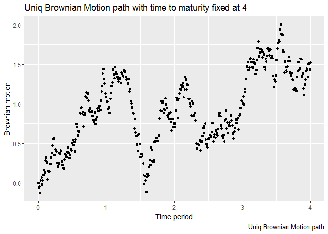

-   [Random Walk R package
    (RandomWalk)](#random-walk-r-package-randomwalk)
    -   [Introduction](#introduction)
        -   [Notes](#notes)
    -   [Functions provided by the
        package](#functions-provided-by-the-package)
    -   [Description of the functions as they was created and
        defined](#description-of-the-functions-as-they-was-created-and-defined)
        -   [srwalkGenerator](#srwalkgenerator)
        -   [srwalk](#srwalk)
        -   [trwalkGenerator](#trwalkgenerator)
        -   [sbmotionGenerator](#sbmotiongenerator)

Random Walk R package (RandomWalk)
==================================

Introduction
------------

The aim of this package is to provide a way to create and manipulate
discrete random walk and brownian motion or list of them. It would be
noticed that the construction of brownian motion is made by taking the
limit of the random walk as its step size goes to zero. The brownian
motion could therefore be read as a continously stepped random walk.

By convention the step size of a random walk (with no scale defined) is
1. It means that at each time step the value of the random walk is
likely to be the former one plus or minus 1. Moreover the step size of a
Scaled Random Walk is defined by the following formula: 1/sqrt(scale) =
sqrt(scale)^(-1). In contrast of the Random Walk, the Brownian Motion
has no natural computed step. Each value taken by its increments, from
time t\_k to t\_l (with k &lt; l) is randomly calculated using the
Normal Law with mean 0 and variance(t\_l - t\_k).

As previously mentioned all caluculation could be made according to
their properties. Among these available:

-   Expectation and variance of random walk/brownian motion
-   Expectation and variance of increments
-   Quadratic variation (source of the volatility computed path by path,
    where probabilities is not taken into account.)

(!) Quadratic variation can be thought as the volatility term of a
random walk/ brownian motion. Even if the special case of Brownian
Motion and Random Walk incurs the same Quadratic Variation among all the
different path.

### Notes

**For more technical information and example of usage** of the
RandomWalk package, please feel free to have a look inside the
[vignettes](/vignettes) repository.

<!-- +++++++++++++++ New H2 +++++++++++++++ -->
Functions provided by the package
---------------------------------

-   Multiple Sampled Radom Walks generator:
    [srwalkGenerator](#srwalkgenerator)
-   Sampled Radom Walk constructor: [srwalk](#srwalk)
-   Theoretical Radom Walk: [trwalkGenerator](#trwalkgenerator)
-   Multiple Brownian Motions generator:
    [sbmotionGenerator](#sbmotiongenerator)
-   Brownian Motion constructor: [sbmotion](#sbmotion)
-   Theoretical Radom Walk: [tbmotion]()
-   Quadratic Variation: [qvar](#qvar)

<!-- +++++++++++++++ New h2 +++++++++++++++ -->
Description of the functions as they was created and defined
------------------------------------------------------------

The following lines does not fully give a set of examples of usage of
the package functions.
<!-- To get a useful bunch of that.. One can refers to "Example" folder. -->
Instead of giving such examples, they provide an brief description of
the arguments the package functions take as well as the way these
agruments are defined (along with the default value they take)

### srwalkGenerator

#### Definition

    # anonymous <- function(x){
    #   # print(paste0("formals(srwalk)$", names(x)))
    #   # c(names(x),
    #   # eval(parse(text = paste0("formals(srwalk)$", names(x)))))
    #   rbind(x)
    # }
    # sapply(c(names(formals(srwalk)), formals(srwalk)), FUN = anonymous)

<table style="width:17%;">
<colgroup>
<col style="width: 5%" />
<col style="width: 5%" />
<col style="width: 5%" />
</colgroup>
<thead>
<tr class="header">
<th>Arguments</th>
<th>Default</th>
<th>Description</th>
</tr>
</thead>
<tbody>
<tr class="odd">
<td>time_to_maturity</td>
<td>100</td>
<td>Final time up to the random walk goes</td>
</tr>
<tr class="even">
<td>prob</td>
<td>0.5</td>
<td>Probability of occurence of head and tail for each step</td>
</tr>
<tr class="odd">
<td>scale</td>
<td>1</td>
<td>Define the partition of the time period. and the scale of up and down factors of the random walk, following the rule: sqrt(scale)^(-1)</td>
</tr>
<tr class="even">
<td>seed</td>
<td>1</td>
<td>The seed fixes initial value of the pseudo random number generation</td>
</tr>
<tr class="odd">
<td>n</td>
<td>1</td>
<td>Number of random walk generated by the function</td>
</tr>
</tbody>
</table>

This function return a R *list* of multiple *data.frame*s. Each one
contains the following variables:

1.  *time\_period*: Ordered vector from 0 up to T(time\_to\_maturity).
    It represents the time period in which the random walk evolved. The
    partition step of this vector depends on the variable *scale*.
2.  *random\_walk\_path*: All random values taken by the sampled random
    walk.

#### Example of usage

    library(RandomWalk)
    # The following line set the variable @sampled with a list of 20
    # data.frame of Adapted random walk.
    Sampled <- srwalkGenerator(time_to_maturity = 500, n = 20)

<!-- +++++++++++++++ srwalk description +++++++++++++++ -->
### srwalk

<table style="width:17%;">
<colgroup>
<col style="width: 5%" />
<col style="width: 5%" />
<col style="width: 5%" />
</colgroup>
<thead>
<tr class="header">
<th>Arguments</th>
<th>Default</th>
<th>Description</th>
</tr>
</thead>
<tbody>
<tr class="odd">
<td>time_to_maturity</td>
<td>100</td>
<td>Final time up to the random walk goes</td>
</tr>
<tr class="even">
<td>prob</td>
<td>0.5</td>
<td>Probability of occurence of head and tail for each step</td>
</tr>
<tr class="odd">
<td>scale</td>
<td>1</td>
<td>Define the partition of the time period. The scale of up and down factors of the random walk follows the rule: <em>s</em><em>q</em><em>r</em><em>t</em>(<em>s</em><em>c</em><em>a</em><em>l</em><em>e</em>)−1</td>
</tr>
<tr class="even">
<td>seed</td>
<td>1</td>
<td>The seed fixes initial value of the pseudo random number generation</td>
</tr>
</tbody>
</table>

This function is defined to be the constructor of a unique Sampled
Random Walk. It returns a uniq S3 object with classes as follow:

    ## [1] "sampled_randomwalk" "data.frame"

srwalk() output a data.frame which contains each step of the time value
along with the associated Sampled Random Walk value.

#### Example of usage

    library(RandomWalk)
    # Generate a 150 steps symmetric random walk
    srw <- srwalk(time_to_maturity =  150)

<table>
<thead>
<tr class="header">
<th style="text-align: right;">time_periods</th>
<th style="text-align: right;">random_walk_path</th>
</tr>
</thead>
<tbody>
<tr class="odd">
<td style="text-align: right;">0</td>
<td style="text-align: right;">0</td>
</tr>
<tr class="even">
<td style="text-align: right;">1</td>
<td style="text-align: right;">1</td>
</tr>
<tr class="odd">
<td style="text-align: right;">2</td>
<td style="text-align: right;">2</td>
</tr>
<tr class="even">
<td style="text-align: right;">3</td>
<td style="text-align: right;">1</td>
</tr>
<tr class="odd">
<td style="text-align: right;">4</td>
<td style="text-align: right;">0</td>
</tr>
<tr class="even">
<td style="text-align: right;">5</td>
<td style="text-align: right;">1</td>
</tr>
</tbody>
</table>

<!-- +++++++++++++++ srwalkGenerator description +++++++++++++++ -->
### trwalkGenerator

<table style="width:17%;">
<colgroup>
<col style="width: 5%" />
<col style="width: 5%" />
<col style="width: 5%" />
</colgroup>
<thead>
<tr class="header">
<th>Arguments</th>
<th>Default</th>
<th>Description</th>
</tr>
</thead>
<tbody>
<tr class="odd">
<td>time_to_maturity</td>
<td>100</td>
<td>Final time up to the Random Walk goes</td>
</tr>
<tr class="even">
<td>prob</td>
<td>0.5</td>
<td>Probability of occurence of head and tail for each step</td>
</tr>
<tr class="odd">
<td>scale</td>
<td>1</td>
<td>Define the partition of the time period. The scale of up and down factors of the Random Walk follows the rule: <em>s</em><em>q</em><em>r</em><em>t</em>(<em>s</em><em>c</em><em>a</em><em>l</em><em>e</em>)−1</td>
</tr>
<tr class="even">
<td>full</td>
<td>FALSE</td>
<td>Number of Brownian Motion generated by the function</td>
</tr>
</tbody>
</table>

This function returns all the values the Random Walk could take along
with their associated probabilities. Either the argument full is set to
FALSE and only the last time period is return or it is set to TRUE and
all the periods are then provided.

It returns a uniq S3 object with classes as follow:

    ## [1] "theoretical_randomwalk" "data.frame"

#### Example of usage

    library(RandomWalk)
    # Generate the distribution of a 150 steps Symmetric Random Walk
    trwalkGenerator(time_to_maturity =  150, full = T)

    # Generate the distribution of a Symmetric Random walk from time 0 to 4.
    # It only returns the last time distribution along with the associated 
    # probabilities
    trwalkGenerator(time_to_maturity = 4, scale = 2)

The last example gives the following result:

<table>
<thead>
<tr class="header">
<th style="text-align: right;">Mt</th>
<th style="text-align: right;">Pr</th>
</tr>
</thead>
<tbody>
<tr class="odd">
<td style="text-align: right;">5.656854</td>
<td style="text-align: right;">0.0039062</td>
</tr>
<tr class="even">
<td style="text-align: right;">4.242641</td>
<td style="text-align: right;">0.0312500</td>
</tr>
<tr class="odd">
<td style="text-align: right;">2.828427</td>
<td style="text-align: right;">0.1093750</td>
</tr>
<tr class="even">
<td style="text-align: right;">1.414214</td>
<td style="text-align: right;">0.2187500</td>
</tr>
<tr class="odd">
<td style="text-align: right;">0.000000</td>
<td style="text-align: right;">0.2734375</td>
</tr>
<tr class="even">
<td style="text-align: right;">-1.414214</td>
<td style="text-align: right;">0.2187500</td>
</tr>
<tr class="odd">
<td style="text-align: right;">-2.828427</td>
<td style="text-align: right;">0.1093750</td>
</tr>
<tr class="even">
<td style="text-align: right;">-4.242641</td>
<td style="text-align: right;">0.0312500</td>
</tr>
<tr class="odd">
<td style="text-align: right;">-5.656854</td>
<td style="text-align: right;">0.0039062</td>
</tr>
</tbody>
</table>

With expectation and variance:

    # Declare the Theoretical Random Walk
    trw <- trwalkGenerator(time_to_maturity = 4, scale = 2) 
    # Expectation:
    (Exp <- sum(trw[, 'Pr'] * trw[, 'Mt']))

    ## [1] 0

    # Variance (Which is, according to the theory, equal to time_to_maturity): 
    sum(trw[, 'Pr'] * trw[, 'Mt'] ^ 2) - Exp

    ## [1] 4

<!-- +++++++++++++++ sbmotionGenerator description +++++++++++++++ -->
### sbmotionGenerator

<table style="width:17%;">
<colgroup>
<col style="width: 5%" />
<col style="width: 5%" />
<col style="width: 5%" />
</colgroup>
<thead>
<tr class="header">
<th>Arguments</th>
<th>Default</th>
<th>Description</th>
</tr>
</thead>
<tbody>
<tr class="odd">
<td>time_to_maturity</td>
<td>100</td>
<td>Final time up to the Brownian Motion goes</td>
</tr>
<tr class="even">
<td>prob</td>
<td>0.5</td>
<td>Probability of occurence of head and tail for each step. Symmetric by default</td>
</tr>
<tr class="odd">
<td>scale</td>
<td>1</td>
<td>Define the partition of the time period. Unlike the Random Walk, Brownian Motion has no natural incremets. Instead the normal law is used to compute each increment.</td>
</tr>
<tr class="even">
<td>n</td>
<td>FALSE</td>
<td>If TRUE, all the periods are returned. If FALSE, only the last one be.</td>
</tr>
</tbody>
</table>

This function returns a R *list* of multiple *data.frame*s. Each one
contains the following variables:

1.  *time\_period*: Ordered vector from 0 up to T(time\_to\_maturity).
    It represents the time period in which the Brownian Motion evolved.
    The partition step of this vector depends on the variable *scale*.
2.  *brownian\_motion\_path*: All random values taken by the Sampled
    Brownian Motion.

#### Example of usage

    library(RandomWalk)
    # The following line set the variable @sampled with a list of 20
    # data.frame of Adapted random walk.
    Sampled <- sbmotionGenerator(time_to_maturity = 4, scale = 100, n = 5)

The above example generates a list of 5 specifics Brownian Motion. To
get an idea of what it represents, the following chart presents the
pathes of those previous Brownian motion:

