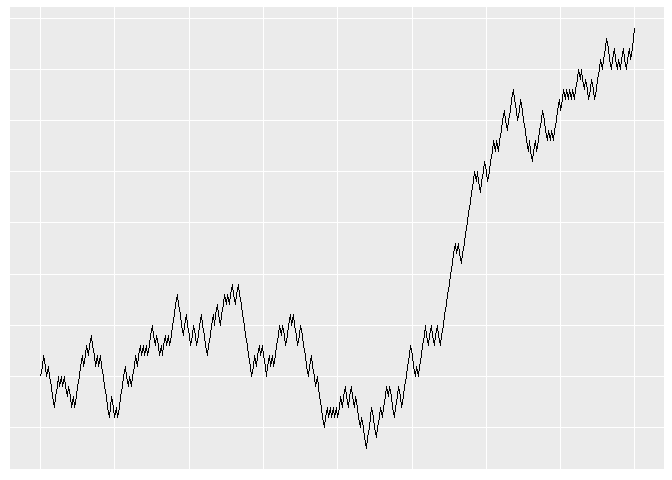
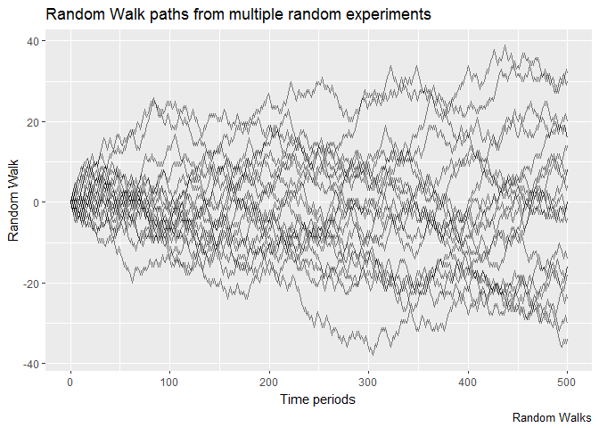
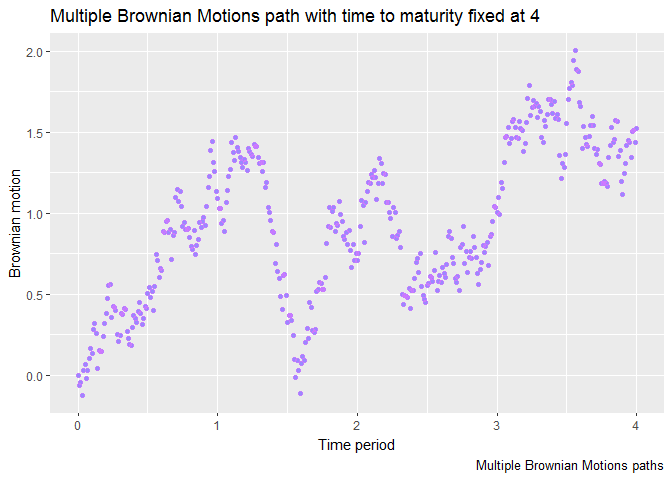

-   [Random Walk R package
    (RandomWalk)](#random-walk-r-package-randomwalk)
    -   [Introduction](#introduction)
        -   [Notes](#notes)
    -   [Functions provided by the
        package](#functions-provided-by-the-package)
        -   [Key functions](#key-functions)
        -   [Getters and Setters](#getters-and-setters)
    -   [Description of the functions as they was created and
        defined](#description-of-the-functions-as-they-was-created-and-defined)
        -   [srwalkGenerator](#srwalkgenerator)
        -   [trwalkGenerator](#trwalkgenerator)
        -   [sbmotionGenerator](#sbmotiongenerator)

Random Walk R package (RandomWalk)
==================================

Introduction
------------

The aim of this package is to provide a way to create and manipulate
either discrete Random Walk or Brownian Motion or even list of them. It
would be noticed that the construction of Brownian Motion is made by
taking the limit of a Scaled Random Walk as its step size goes to zero.
The Brownian Motion could therefore be read as a continously stepped
Random Walk.

By convention the *time step size* of a Random Walk (with no scale
defined) is 1. It means that the value of the Non-Scaled Random Walk
updates each *time increment* of one. Furthermore the *increments* of a
*Non-Scaled (Unscaled) Random Walk* are either 1 or -1, depending on
chance (with a Symmetric Non-Scaled Random Walk, getting 1 or -1 as
increment is just as likely to occur.) All that preceed points out that
at each time step the value of the random walk is sure to be the former
one plus or minus 1.

Unlike the Unscaled Random Walk the *increments* of a *Scaled Random
Walk* is defined by the following formula: $\\sqrt{scale}^{-1}$. Further
more its *time step size* is no longer one but are defined by the value
of *scale* and is $\\frac{time\\\_to\\\_maturity}{scale}$

Finally and Also in contrast with the Scaled / Unscaled Random Walk, the
*Brownian Motion* has neither natural *increments* not *discrete time
step*. Each value taken by its increments, from time *t**k*
to *t**l* (with *k* &lt; *l*) is randomly computed using the
Normal Law with *m**e**a**n* = 0 and
*v**a**r**i**a**n**c**e* = *t**l* − *t**k*:
*N* ∼ (0,*t**l*−*t**k*)

The package also implements some properties of the Random Walk and
Brownian Motion Either to validate some test cases or directly for added
functionalities.

Among the following ones:

-   Expectation and variance of Random Walk/Brownian Motion
-   Expectation and variance of increments
-   *Quadratic Variation* (Source of the Black-Scholes-Merton
    volatility. Computed path by path, where probabilities are not taken
    into account.)

:exclamation: The special case of Brownian Motion and Random Walk is
that they incur *the same Quadratic Variation* among all the different
paths.

### Notes

**For more technical informations and example of usage** of the
RandomWalk package, feel free to have a look inside the
[vignettes](/vignettes) repository.

<!-- +++++++++++++++ New H2 +++++++++++++++ -->
Functions provided by the package
---------------------------------

### Key functions

-   Multiple Sampled Radom Walks generator:
    [srwalkGenerator](#srwalkgenerator)
-   Sampled Radom Walk constructor: [srwalk](#srwalk)
-   Theoretical Radom Walk generator:
    [trwalkGenerator](#trwalkgenerator)
-   Multiple Brownian Motions generator:
    [sbmotionGenerator](#sbmotiongenerator)
-   Brownian Motion constructor: [sbmotion](#sbmotion)
-   Theoretical Brownian Motion generator: [tbmotion]()
-   Quadratic Variation: [qvar](#qvar)

### Getters and Setters

-   To use for retrieving a specific value of one the previous process:
    [get\_values](get_values)

<!-- +++++++++++++++ New h2 +++++++++++++++ -->
Description of the functions as they was created and defined
------------------------------------------------------------

The following lines do not fully give a bunch of examples of usage of
the package functions.

Instead of giving such examples, they provide an brief description of
the arguments the package functions take as well as the way these
agruments are defined (along with the default value they take)

<!-- +++++++++++++++ New h3 +++++++++++++++ -->
<!-- +++++++++++++++ srwalkGenerator +++++++++++++++ -->
### srwalkGenerator

#### Summary

This function return a R *list* of multiple *data.frame* s. Each one
contains the following variables:

1.  *time\_periods*: Ordered vector from 0 up to T(time\_to\_maturity).
    It represents a partition of the period of time where the random
    walk evolved. The partition step of this vector depends on the
    variable *scale*.
2.  *random\_walk\_path*: Provides all the random values taken by the
    sampled random walk.

#### Arguments

<table style="width:17%;">
<colgroup>
<col style="width: 5%" />
<col style="width: 5%" />
<col style="width: 5%" />
</colgroup>
<thead>
<tr class="header">
<th>Arguments</th>
<th>Default</th>
<th>Description</th>
</tr>
</thead>
<tbody>
<tr class="odd">
<td>time_to_maturity</td>
<td>100</td>
<td>Final time up to the Random Walk goes</td>
</tr>
<tr class="even">
<td>prob</td>
<td>0.5</td>
<td>Probability of occurence of head and tail for each step</td>
</tr>
<tr class="odd">
<td>scale</td>
<td>1</td>
<td>Define the partition of the time period and the scale of up and down factors of the increments, following the rule: $\sqrt{scale}^{-1}$</td>
</tr>
<tr class="even">
<td>seed</td>
<td>1</td>
<td>It fixes initial value of the pseudo random number generation in order to get reproducible experiments.</td>
</tr>
<tr class="odd">
<td>n</td>
<td>1</td>
<td>Number of Random Walk generated by the function</td>
</tr>
</tbody>
</table>

#### Example of usage

    library(RandomWalk)
    # The following line set the variable @sampled with a list of 20
    # data.frame of Adapted random walk.
    Sampled <- srwalkGenerator(time_to_maturity = 500, 
                               seed = 7,
                               n = 20)

The previous Sampled Random Walks could be reduce to its graphical
representation:

    ggplot2::ggplot(dplyr::bind_rows(Sampled, .id = "uid")
                    , ggplot2::aes(x = time_periods, 
                                   y = random_walk_path,
                                   group = uid)) +
    ggplot2::geom_line(alpha = .5) + 
    ggplot2::labs(title = "Random Walk paths from multiple random experiments", 
                  caption = "Random Walks",
                  x = 'Time periods',
                  y = 'Random Walk')

<!-- +++++++++++++++ New h3 +++++++++++++++ -->
<!-- +++++++++++++++ srwalk description +++++++++++++++ -->
#### Summary

This function is defined to be the constructor of a unique Sampled
Random Walk. It returns a unique S3 object with classes as follow:

    ## [1] "sampled_randomwalk" "data.frame"

srwalk() outputs a data.frame which contains each time value step along
with the associated Sampled Random Walk value, arranged as follow:

1.  *time\_periods*: Ordered vector from 0 up to T(time\_to\_maturity).
    It represents a partition of the period of time where the random
    walk evolved. The partition step of this vector depends on the
    variable *scale*.
2.  *random\_walk\_path*: Provides all the random values taken by the
    sampled random walk.

#### Arguments

<table style="width:17%;">
<colgroup>
<col style="width: 5%" />
<col style="width: 5%" />
<col style="width: 5%" />
</colgroup>
<thead>
<tr class="header">
<th>Arguments</th>
<th>Default</th>
<th>Description</th>
</tr>
</thead>
<tbody>
<tr class="odd">
<td>time_to_maturity</td>
<td>100</td>
<td>Final time up to the Random Walk goes</td>
</tr>
<tr class="even">
<td>prob</td>
<td>0.5</td>
<td>Probability of occurence of head and tail for each step</td>
</tr>
<tr class="odd">
<td>scale</td>
<td>1</td>
<td>Define the partition of the time period and the scale of up and down factors of the increments, following the rule: $\sqrt{scale}^{-1}$</td>
</tr>
<tr class="even">
<td>seed</td>
<td>1</td>
<td>It fixes initial value of the pseudo random number generation in order to get reproducible experiments.</td>
</tr>
<tr class="odd">
<td>n</td>
<td>1</td>
<td>Number of Random Walk generated by the function</td>
</tr>
</tbody>
</table>

#### Example of usage

    library(RandomWalk)
    # Generate a 150 steps Unscale Symmetric Random Walk
    srw <- srwalk(time_to_maturity =  150)

<table>
<thead>
<tr class="header">
<th style="text-align: right;">time_periods</th>
<th style="text-align: right;">random_walk_path</th>
</tr>
</thead>
<tbody>
<tr class="odd">
<td style="text-align: right;">0</td>
<td style="text-align: right;">0</td>
</tr>
<tr class="even">
<td style="text-align: right;">1</td>
<td style="text-align: right;">1</td>
</tr>
<tr class="odd">
<td style="text-align: right;">2</td>
<td style="text-align: right;">2</td>
</tr>
<tr class="even">
<td style="text-align: right;">3</td>
<td style="text-align: right;">1</td>
</tr>
<tr class="odd">
<td style="text-align: right;">4</td>
<td style="text-align: right;">0</td>
</tr>
<tr class="even">
<td style="text-align: right;">5</td>
<td style="text-align: right;">1</td>
</tr>
</tbody>
</table>

<!-- +++++++++++++++ srwalkGenerator description +++++++++++++++ -->
<!-- +++++++++++++++ HERE +++++++++++++++ -->
<!-- +++++++++++++++ HERE +++++++++++++++ -->
<!-- +++++++++++++++ HERE +++++++++++++++ -->
<!-- +++++++++++++++ HERE +++++++++++++++ -->
### trwalkGenerator

<table style="width:17%;">
<colgroup>
<col style="width: 5%" />
<col style="width: 5%" />
<col style="width: 5%" />
</colgroup>
<thead>
<tr class="header">
<th>Arguments</th>
<th>Default</th>
<th>Description</th>
</tr>
</thead>
<tbody>
<tr class="odd">
<td>time_to_maturity</td>
<td>100</td>
<td>Final time up to the Random Walk goes</td>
</tr>
<tr class="even">
<td>prob</td>
<td>0.5</td>
<td>Probability of occurence of head and tail for each step</td>
</tr>
<tr class="odd">
<td>scale</td>
<td>1</td>
<td>Define the partition of the time period. The scale of up and down factors of the Random Walk follows the rule: <em>s</em><em>q</em><em>r</em><em>t</em>(<em>s</em><em>c</em><em>a</em><em>l</em><em>e</em>)−1</td>
</tr>
<tr class="even">
<td>full</td>
<td>FALSE</td>
<td>Number of Brownian Motion generated by the function</td>
</tr>
</tbody>
</table>

This function returns all the values the Random Walk could take along
with their associated probabilities. Either the argument full is set to
FALSE and only the last time period is return or it is set to TRUE and
all the periods are then provided.

It returns a uniq S3 object with classes as follow:

    ## [1] "theoretical_randomwalk" "data.frame"

#### Example of usage

    library(RandomWalk)
    # Generate the distribution of a 150 steps Symmetric Random Walk
    trwalkGenerator(time_to_maturity =  150, full = T)

    # Generate the distribution of a Symmetric Random walk from time 0 to 4.
    # It only returns the last time distribution along with the associated 
    # probabilities
    trwalkGenerator(time_to_maturity = 4, scale = 2)

The last example gives the following result:

<table>
<thead>
<tr class="header">
<th style="text-align: right;">Mt</th>
<th style="text-align: right;">Pr</th>
</tr>
</thead>
<tbody>
<tr class="odd">
<td style="text-align: right;">5.656854</td>
<td style="text-align: right;">0.0039062</td>
</tr>
<tr class="even">
<td style="text-align: right;">4.242641</td>
<td style="text-align: right;">0.0312500</td>
</tr>
<tr class="odd">
<td style="text-align: right;">2.828427</td>
<td style="text-align: right;">0.1093750</td>
</tr>
<tr class="even">
<td style="text-align: right;">1.414214</td>
<td style="text-align: right;">0.2187500</td>
</tr>
<tr class="odd">
<td style="text-align: right;">0.000000</td>
<td style="text-align: right;">0.2734375</td>
</tr>
<tr class="even">
<td style="text-align: right;">-1.414214</td>
<td style="text-align: right;">0.2187500</td>
</tr>
<tr class="odd">
<td style="text-align: right;">-2.828427</td>
<td style="text-align: right;">0.1093750</td>
</tr>
<tr class="even">
<td style="text-align: right;">-4.242641</td>
<td style="text-align: right;">0.0312500</td>
</tr>
<tr class="odd">
<td style="text-align: right;">-5.656854</td>
<td style="text-align: right;">0.0039062</td>
</tr>
</tbody>
</table>

With expectation and variance:

    # Declare the Theoretical Random Walk
    trw <- trwalkGenerator(time_to_maturity = 4, scale = 2) 
    # Expectation:
    (Exp <- sum(trw[, 'Pr'] * trw[, 'Mt']))

    ## [1] 0

    # Variance (Which is, according to the theory, equal to time_to_maturity): 
    sum(trw[, 'Pr'] * trw[, 'Mt'] ^ 2) - Exp

    ## [1] 4

<!-- +++++++++++++++ sbmotionGenerator description +++++++++++++++ -->
### sbmotionGenerator

<table style="width:17%;">
<colgroup>
<col style="width: 5%" />
<col style="width: 5%" />
<col style="width: 5%" />
</colgroup>
<thead>
<tr class="header">
<th>Arguments</th>
<th>Default</th>
<th>Description</th>
</tr>
</thead>
<tbody>
<tr class="odd">
<td>time_to_maturity</td>
<td>100</td>
<td>Final time up to the Brownian Motion goes</td>
</tr>
<tr class="even">
<td>prob</td>
<td>0.5</td>
<td>Probability of occurence of head and tail for each step. Symmetric by default</td>
</tr>
<tr class="odd">
<td>scale</td>
<td>1</td>
<td>Define the partition of the time period. Unlike the Random Walk, Brownian Motion has no natural incremets. Instead the normal law is used to compute each increment.</td>
</tr>
<tr class="even">
<td>n</td>
<td>FALSE</td>
<td>If TRUE, all the periods are returned. If FALSE, only the last one be.</td>
</tr>
</tbody>
</table>

This function returns a R *list* of multiple *data.frame*s. Each one
contains the following variables:

1.  *time\_period*: Ordered vector from 0 up to T(time\_to\_maturity).
    It represents the time period in which the Brownian Motion evolved.
    The partition step of this vector depends on the variable *scale*.
2.  *brownian\_motion\_path*: All random values taken by the Sampled
    Brownian Motion.

#### Example of usage

    library(RandomWalk)
    # The following line set the variable @sampled with a list of 20
    # data.frame of Adapted random walk.
    Sampled <- sbmotionGenerator(time_to_maturity = 4, scale = 100, n = 5)

The above example generates a list of 5 specifics Brownian Motion. To
get an idea of what it represents, the following chart presents the
pathes of those previous Brownian motion:

